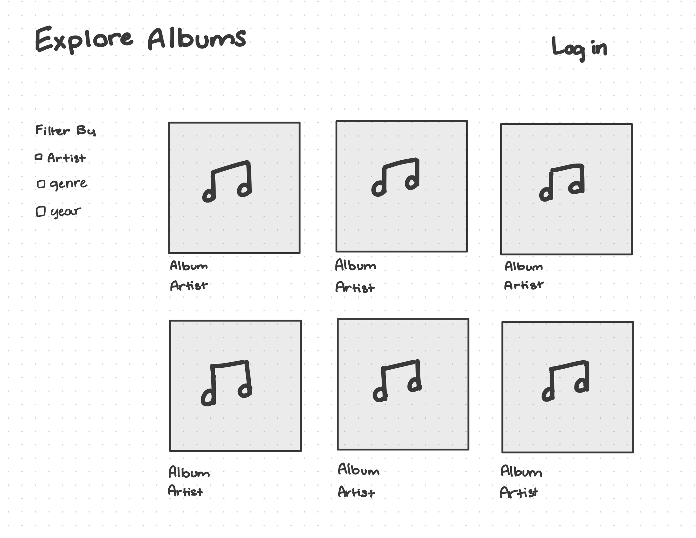
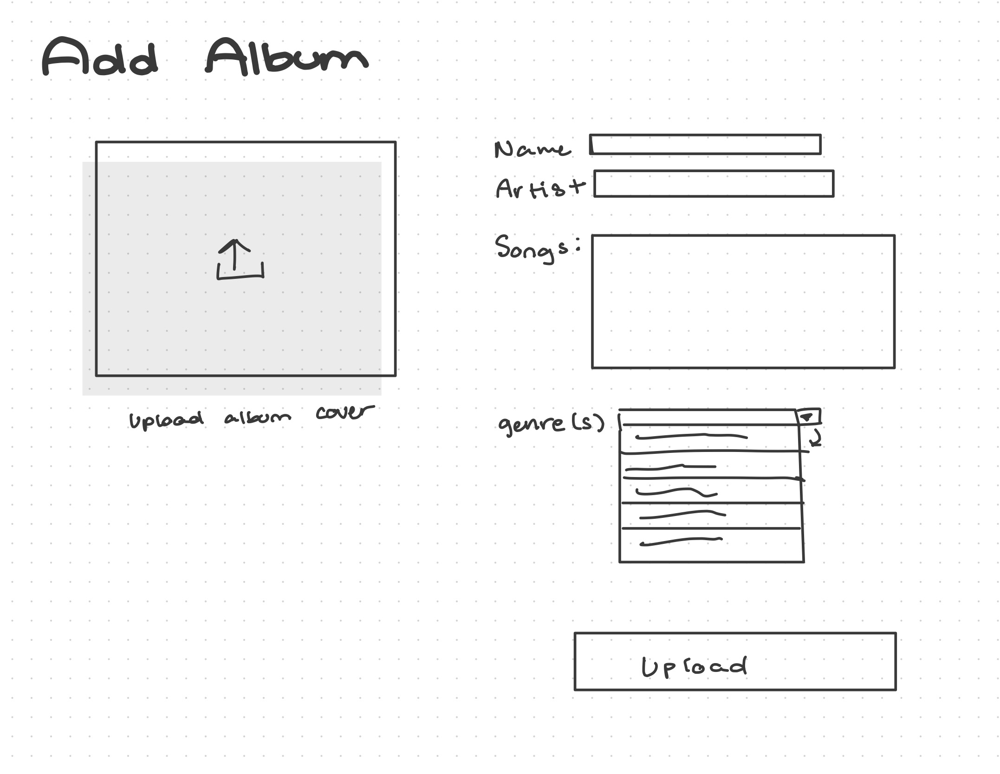

# Project 3: Design Journey

**For each milestone, complete only the sections that are labeled with that milestone.** Refine all sections before the final submission.

You are graded on your design process. If you later need to update your plan, **do not delete the original plan, rather leave it in place and append your new plan _below_ the original.** Then explain why you are changing your plan. Any time you update your plan, you're documenting your design process!

**Replace ALL _TODOs_ with your work.** (There should be no TODOs in the final submission.)

Be clear and concise in your writing. Bullets points are encouraged.

**Everything, including images, must be visible in _Markdown: Open Preview_.** If it's not visible in the Markdown preview, then we can't grade it. We also can't give you partial credit either. **Please make sure your design journey should is easy to read for the grader;** in Markdown preview the question _and_ answer should have a blank line between them.


## Design Plan (Milestone 1)

**Make the case for your decisions using concepts from class, as well as other design principles, theories, examples, and cases from outside of class (includes the design prerequisite for this course).**

You can use bullet points and lists, or full paragraphs, or a combo, whichever is appropriate. The writing should be solid draft quality.


### Catalog (Milestone 1)
> What will your catalog website be about? (1 sentence)

My website will be a catalog of some of my favorite music albums, with an option for any users who are logged in to add their own albums.


### _Consumer_ Audience (Milestone 1)
> Briefly explain your site's _consumer_ audience. Your audience should be specific, but not arbitrarily specific. (1 sentence)
> Justify why this audience is a **cohesive** group. (1-2 sentences)

The site's audience is primarily people who are interested in discovering new music and hope to find new albums/songs/artists.

### _Consumer_ Audience Goals (Milestone 1)
> Document your _consumer_ audience's goals for using this catalog website.
> List each goal below. There is no specific number of goals required for this, but you need enough to do the job (Hint: It's more than 1. But probably not more than 3.)
> **Hint:** Users will be able to view all entries in the catalog and insert new entries into the catalog. The audience's goals should probably relate to these activities.

Goal 1: View songs in each album

- **Design Ideas and Choices** _How will you meet those goals in your design?_
  - I plan to design a details page for each album, which will display all the songs contained in each album
- **Rationale & Additional Notes** _Justify your decisions; additional notes._
  - This follows standard design principles, where when you click on an entry you are able to see all the expanded details of the entry.

Goal 2: Easily see album and artist names without having to navigate to the details page

- **Design Ideas and Choices** _How will you meet those goals in your design?_
  - I will include the Album and Artist name under each album cover entry.
- **Rationale & Additional Notes** _Justify your decisions; additional notes._
  - This allows consumers to easily access the basic information about each entry without having to take the extra step of navigating to a new page

Goal 3: Sort and filter based on tags

- I plan to include tags on each album such as artists, genres, and more.


**Goal 1 Revision**

Goal 1: See the genre(s) of each album

- **Design Ideas and Choices** _How will you meet those goals in your design?_
  - I plan to design a details page for each album, which will display all the extra information regarding each album, including the album genres
- **Rationale & Additional Notes** _Justify your decisions; additional notes._
  - This follows standard design principles, where when you click on an entry you are able to see all the expanded details of the entry.


### _Consumer_ Audience Device (Milestone 1)
> How will your _consumer_ audience access this website? From a narrow (phone) or wide (laptop) device?
> Justify your decision. (1 sentence)

My site will be primarily accessed through desktop, because the site will serve as a browsable catalog, and the sort and filter features will be much easier to fit within a desktop view.

### _Consumer_ Persona (Milestone 1)
> Use the goals you identified above to develop a persona of your site's _consumer_ audience.
> Your persona must have a name and a face. The face can be a photo of a face or a drawing, etc.


Ashley

**Factors that Influence Behavior:**

Ashley is a teenager looking to explore new artists to listen to. She prefers seeing what real people are listening to instead of going off of music charts and rankings

**Goals:**

She wants to discover new music, and is especially interested in pop and hip hop genres.

**Obstacles:**

She tried to reference popular songs and billboard charts to find new music, but they didn't really align with her tastes

**Desires:**

Ashley has found her favorite songs through recomendations from her friends, so she wants to see what actual people are listening to.


### _Administrator_ Audience (Milestone 1)
> Briefly explain your site's _administrator_ audience. Your audience should be specific, but not arbitrarily specific. (1 sentence)
> Justify why this audience is a **cohesive** group. (1-2 sentences)

The administrator audience will primarily be people who are interested in sharing their own music tastes.

This is a cohesive audience as everyone within this user base shares the same main goals.

### _Administrator_ Audience Goals (Milestone 1)
> Document your _administrator_ audience's goals for using this catalog website.
> List each goal below. There is no specific number of goals required for this, but you need enough to do the job (Hint: It's more than 1. But probably not more than 3.)
> **Hint:** Users will be able to view all entries in the catalog and insert new entries into the catalog. The audience's goals should probably relate to these activities.

Goal 1: Upload new entries

- **Design Ideas and Choices** _How will you meet those goals in your design?_
  - I will create a separate form for administrators to input their own albums, where they can enter album info, songs, etc.
- **Rationale & Additional Notes** _Justify your decisions; additional notes._
  - Since this is the necessary info needed on the consumer end, it would make sense to allow the administrators to be able to input this info.

Goal 2: Easily add tags to each entry

- **Design Ideas and Choices** _How will you meet those goals in your design?_
  - I plan to create a drop down menu in the form when selecting tags
- **Rationale & Additional Notes** _Justify your decisions; additional notes._
  - This will accomodate for tags that are likely to repeat (popular genres, etc.)

Goal 3: Sort and filter entries based on tags

I plan to include tags on each album such as artists, genres, and more.


### _Administrator_ Persona (Milestone 1)
> Use the goals you identified above to develop a persona of your site's _administrator_ audience.
> Your persona must have a name and a face. The face can be a photo of a face or a drawing, etc.


Mac

**Factors that Influence Behavior:**

Mac is a student who is very passionate about music and wants to share his favorite albums with others and see what his friends are listening to. He dislikes music sharing apps like Spotify or Apple music because he prefers a much more simple interface.

**Goals:**

Mac wants to be able easily share and upload his favorite albums.

**Obstacles:**

Mac struggles with common music sharing apps like Spotify because he finds it difficult to navigate to his friends profiles and vice versa.

**Desires:**

Wants a simple interface that is convenient and easy to use.


### Catalog Data (Milestone 1)
> Using your personas, identify the data you need to include in the catalog for your site's audiences.
> Justify why this data aligns with your persona's goals. (1 sentence)

In order to use this catalog effectively, the catalog must include:

- album name
- artist name
- songs in each album
- genre of album
- date/year released
- username of person who uploaded (administrator)

This data is all of the core criteria needed for a user to identify the new album and narrow down the search towards certain preferences.

**Revision**

- album name
- artist name
- genre of album
- username of person who uploaded (administrator)

(I realized that including other info, espcially the songs in each album, actually unneccesirally complicates my database and is not fully necessary to meet my user's needs)

### Site Design (Milestone 1)
> Design your catalog website to address the goals of your personas.
> Sketch your site's design:
>
> - These are **design** sketches, not _planning_ sketches.
> - Use text in the sketches to help us understand your design.
> - Where the content of the text is unimportant, you may use squiggly lines for text.
> - **Do not label HTML elements or annotate CSS classes.** This is not a planning sketch.
>
> Provide a brief explanation _underneath_ each sketch. (1 sentence)
> **Refer to your persona by name in each explanation.**



The main home sketch from the consumer view displays each album in a grid view, with the album title and artist listed underneath, and finally a dilter feature located on the left hand side.



The login page is extrmemely simple, with an option for the user's name, email, and password.


The home page from the administrator view is essentially identical to the consumer view, with the exception of the added tag of seeing what posters posted what songs.


The form is split into two columns, and allows the admin to input all the information that is displayed on the catalg.

### Catalog Design Patterns (Milestone 1)
> Explain how you used design patterns in your site's design. (1-2 sentences)

My design uses a grid based design, similar to that used by online shopping sites, to display each album.

## Implementation Plan (Milestone 1, Milestone 2, Milestone 3, Final Submission)

### Database Schema (Milestone 1)
> Plan the structure of your database. You may use words or a picture.
> A bulleted list is probably the simplest way to do this.
> Make sure you include constraints for each field.

CREATE TABLE users (
    id INTEGER NOT NULL UNIQUE,
    name TEXT NOT NULL,
    email TEXT NOT NULL,
    PRIMARY KEY(id AUTOINCREMENT)
);

CREATE TABLE albums (
    id INTEGER NOT NULL UNIQUE,
    title TEXT NOT NULL,
    artist TEXT NOT NULL,
    user_id TEXT NOT NULL,
    PRIMARY KEY(id AUTOINCREMENT)
);

CREATE TABLE songs (
    id INTEGER NOT NULL UNIQUE,
    album_id INTEGER NOT NULL,
    title TEXT NOT NULL,
    song_len INTEGER NOT NULL,
    PRIMARY KEY(id AUTOINCREMENT)
);

**Revision**

CREATE TABLE albums (
	  id INTEGER NOT NULL UNIQUE,
    title TEXT NOT NULL,
    PRIMARY KEY(id AUTOINCREMENT)
)

CREATE TABLE tags (
	  id INTEGER NOT NULL UNIQUE,
    tag TEXT NOT NULL,
    PRIMARY KEY(id AUTOINCREMENT)
)

CREATE TABLE album-tags (
    id INTEGER NOT NULL UNIQUE,
    album_id INTEGER NOT NULL,
    tag_id INTEGER NOT NULL,
    PRIMARY KEY(id AUTOINCREMENT)
)

### Database Query Plan (Milestone 1, Milestone 2, Milestone 3, Final Submission)
> Plan _all_ of your database queries.
> You may use natural language, pseudocode, or SQL.

```
"SELECT albums.title AS 'albums.title', albums.artist AS 'albums.artist', albums.user AS 'albums.user' FROM albums"
```
"SELECT albums.title AS 'albums.title', albums.artist AS 'albums.artist', albums.user AS 'albums.user', genres.genre AS 'genres.genre' FROM albums INNER JOIN album_genres ON (albums.id = album_id) INNER JOIN genres ON (album_genres.genre_id = genres.id) WHERE albums.title = :detail_id"
```
"SELECT albums.id AS 'albums.id', albums.title AS 'albums.title', albums.artist AS 'albums.artist', albums.file_ext AS 'albums.file_ext', albums.source AS 'albums.source', genres.genre AS 'genres.genre' FROM albums INNER JOIN album_genres ON (albums.id = album_id) INNER JOIN genres ON (album_genres.genre_id = genres.id)"```
```
"SELECT * FROM albums";

"SELECT * FROM genres"

"SELECT albums.title AS 'albums.title', genres.genre AS 'genres.genre' FROM albums INNER JOIN album_genres ON (albums.id = album_id) INNER JOIN genres ON (album_genres.genre_id = genres.id) WHERE albums.title = :detail_id"

## Complete & Polished Website (Final Submission)

### Accessibility Audit (Final Submission)
> Tell us what issues you discovered during your accessibility audit.
> What do you do to improve the accessibility of your site?

For my accesibility audit I added alt text to each of my album cover entries. I also added proper form labels for each form input.


### Self-Reflection (Final Submission)
> Reflect on what you learned during this assignment. How have you improved from Projects 1 and 2?

I think this assignment really deepened my understanding of php and backend programming in general. Before, I was mostly just focusing on redoing what we had done in class. However, project 3 really forced me to go out on my own and program feature beyond just a surface level understanding. It was both incredibly frustrating and horribly time-consuming, but I really do feel like it was worth it.


> Take some time here to reflect on how much you've learned since you started this class. It's often easy to ignore our own progress. Take a moment and think about your accomplishments in this class. Hopefully you'll recognize that you've accomplished a lot and that you should be very proud of those accomplishments! (1-3 sentences)

Project 3 definitely tested my limits as far as my web development skills go. For every new function that we learned in class, such as custom routing, filtering, etc, I contineud to think how I could incorporate these features in my own custom website.

### Collaborators (Final Submission)
> List any persons you collaborated with on this project.

INFO 2300 TAs

### Reference Resources (Final Submission)
> Please cite any external resources you referenced in the creation of your project.
> (i.e. W3Schools, StackOverflow, Mozilla, etc.)

- W3Schools
- StackOverflow
- CSS-tricks
- PHPtutorial
- Mozilla
- PHP Reference


### Grading: User Accounts (Final Submission)
> The graders will need to log in to your website.
> Please provide the usernames and passwords.

**Administrator User:**

- Username: anna
- Password: monkey

- Username: emily
- Password: monkey

- Username: lindsay
- Password: monkey

- Username: courtney
- Password: monkey

**Consumer User:**

- My site does not support consumer login

**Note:** Not all websites will support consumer log in. If your website doesn't, say so.


### Grading: Step-by-Step Instructions (Final Submission)
> Write step-by-step instructions for the graders.
> The project if very hard to grade if we don't understand how your site works.
> For example, you must log in before you can delete.
> For each set of instructions, assume the grader is starting from /

_View all entries:_

1. on the home page, click the 'view all albums' button

_View all entries for a tag:_

1. once on the homepage, there will be a filter on the left
2. select whichever tag you would like to view (can only select one tag at once)
3. to reset, simply click on the 'Reset' link

_View a single entry's details:_

1. click the blue/purple box underneath each album cover with the album title and artist

_How to insert and upload a new entry:_

1. log in
2. once logged in, there will be a link to 'Add Album' on the top right header

_How to delete an entry:_

I did not implement a delete feature
